# Personal Journaling App

## Table of Contents

- [Introduction](#introduction)
- [Getting Started](#getting_started)
- [Features & Screenshots](#getting_started)

## Introduction

This project contains code for the backend and frontend of a personal journaling application. The backend is built with the NestJS framework and postgres as the preferred database while the frontend is built with React Native (Expo).

## Getting Started

1. Clone this repo into your machine `git clone https://github.com/ezQel/Journal.git`.
2. [Follow the instructions here](/Backend/README.md) to setup the backend application.
3. [Follow the instructions here](/App/README.md) to setup the frontend application.

## Features & Screenshots

1. View List of Journals
   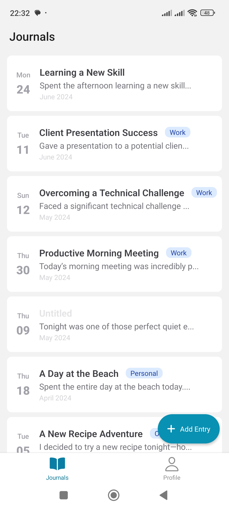

2. Add a journal entry
   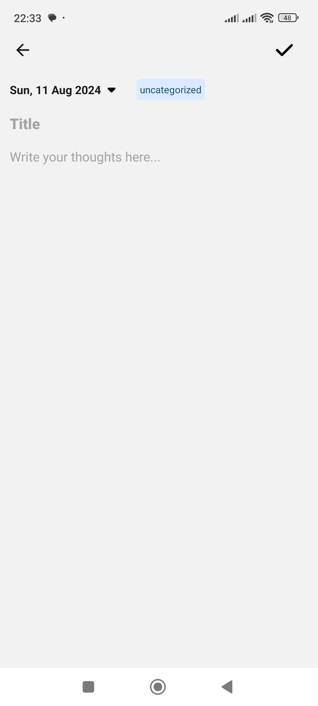
   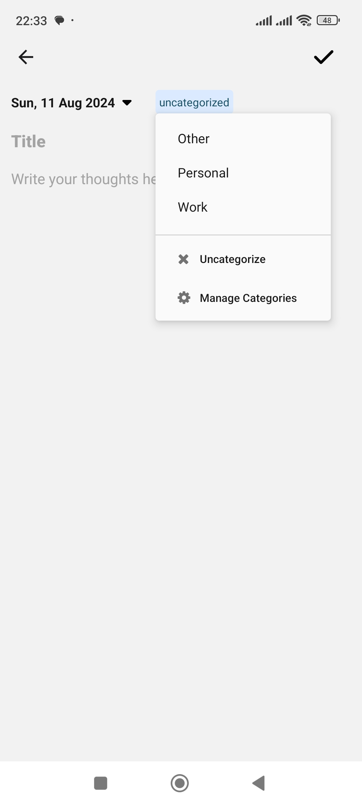

3. Manage journal categories
   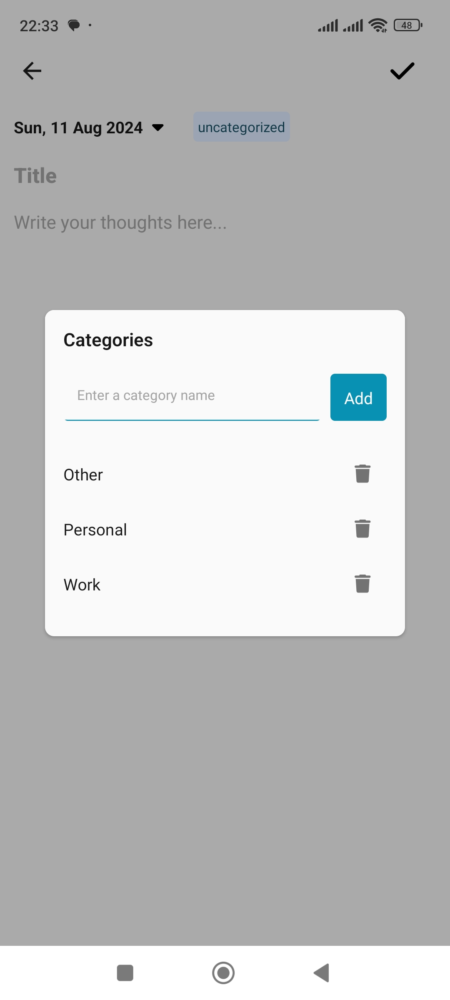

4. View an entry
   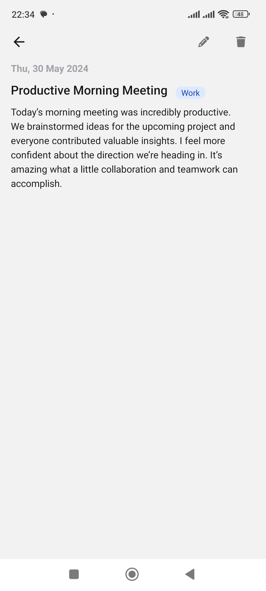

5. Delete an entry
   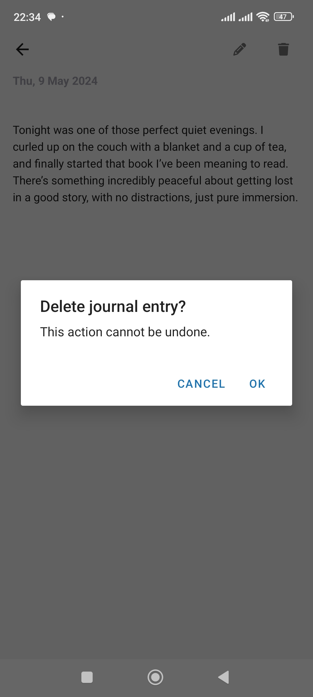

6. Edit an entry
   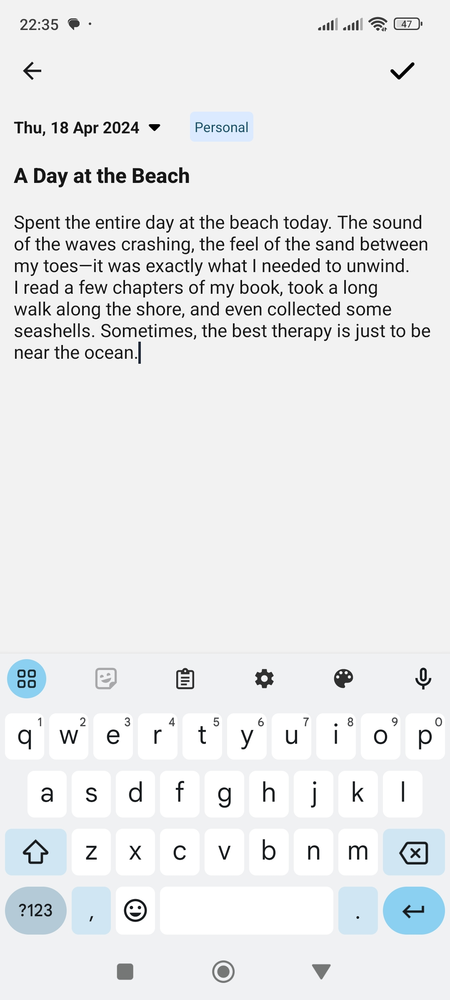

7. Log in
   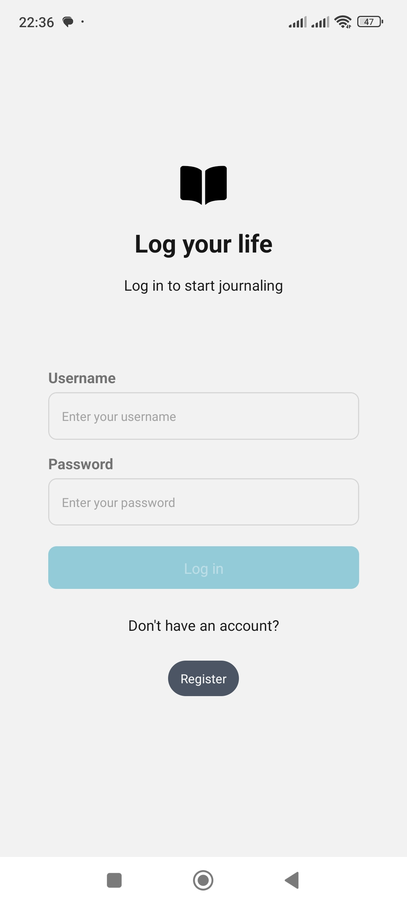

8. Create an account
   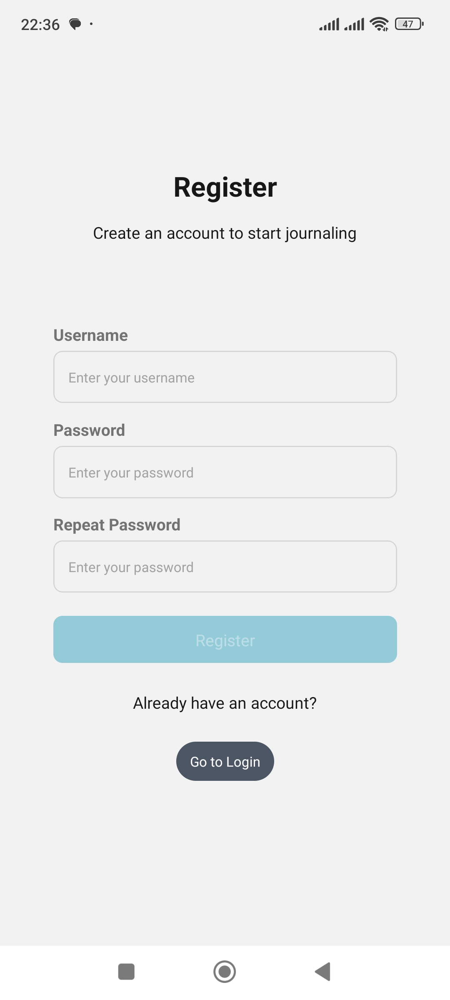

9. View profile
   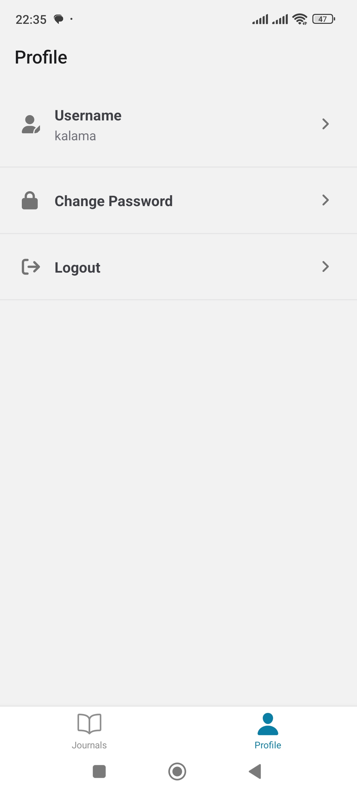

10. Change username
    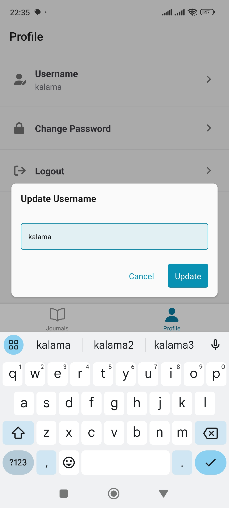

11. Change password
    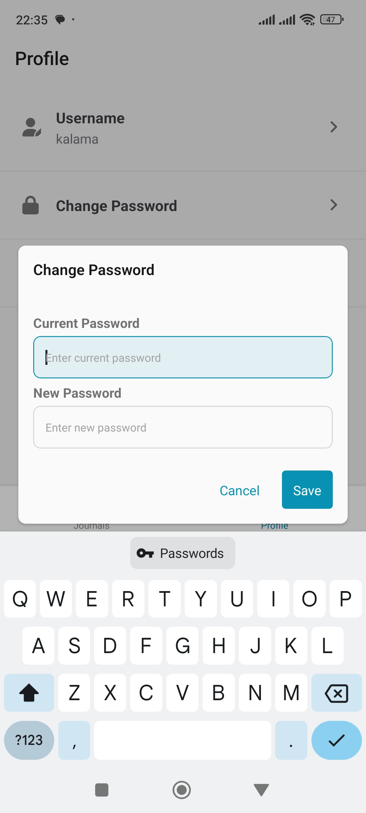
